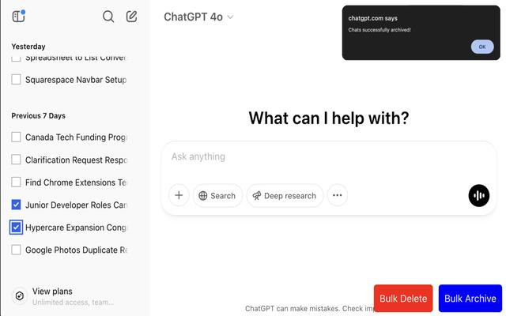
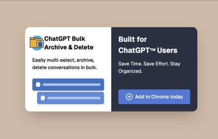

# ChatGPT Bulk Archive & Delete Extension  

Easily manage your ChatGPT conversations with **bulk archive** & **bulk delete** functionality.  

---

## Features  
 **Checkbox Selection** – Easily select chats using checkboxes.  
 **Bulk Archive** – Archive selected conversations for later use.  
  **Bulk Delete** – Remove multiple chats at once.  
 **User-Friendly Controls** – Buttons for bulk actions appear at the bottom right.  
 **Secure Authentication** – Uses your session token to authenticate API requests.  
 **Efficient UI** – Prevents duplicate checkboxes & buttons.  

---

## 🛠️ Installation  
1. **Download the extension folder**.
2. Open **Chrome** and go to `chrome://extensions/`.  
3. Enable **Developer Mode** (top-right toggle).  
4. Click **Load unpacked** and select the extension folder.  
5. The extension will now be installed!   

---

## How to Use  
1. Open and login to**ChatGPT** (`https://chatgpt.com`).  
2. **Check the boxes** next to the conversations you want to delete/archive.  
3. Click either **"Bulk Delete"** (Red) or **"Bulk Archive"** (Blue).  
4. **Chats will be deleted or archived instantly.**  

## Gallery 
Here are some screenshots demonstrating the extension in action: 
### Demo  
  
*The interface showing how chats can be selected and actions can be applied.*  

### Banner  
  
*A stylish banner showcasing the extension's functionality and user-friendly controls.*  

---

## Troubleshooting  
### Why isn’t the delete/archive button appearing?  
- Refresh the page and check if the extension is active (`chrome://extensions/`).  

### My chats aren't deleting/archiving!  
- Open Developer Tools (`F12` > Console) and check if the API requests are failing.  
- Try **refreshing ChatGPT** and **reselecting chats** before clicking archive/delete.  

### Can I undo a delete/archive?  
- Unfortunately, no. Once a chat is deleted, it **cannot be recovered**. Be careful when selecting chats!  

---

## Development  
### Modifying the Code  
- The core functionality is in `content.js`.  
- Check for console logs (`F12` > Console) when debugging.  

### Future Enhancements  
- **Bulk Restore Feature** – Unarchive chats.
- **UI Enhancements** – Add a pop-up UI for managing actions.    
---

## License  
**MIT License** – Free to modify and use! 

---

## Built for ChatGPT Users – Save Time & Stay Organized! ☺
